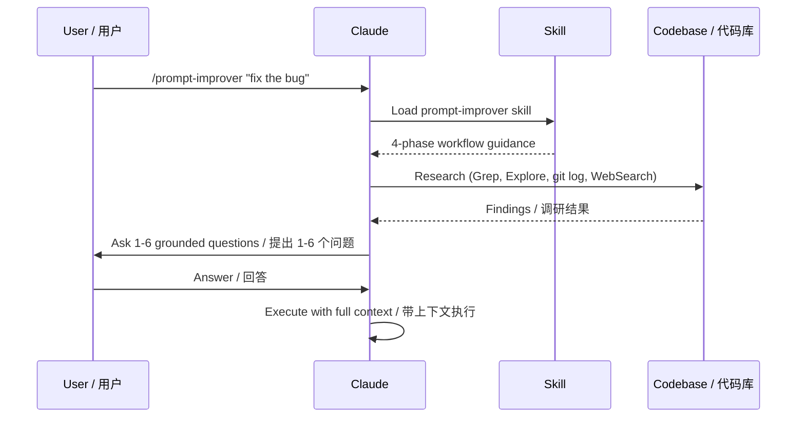

# Claude Code Prompt Improver

On-demand `/prompt-improver` skill for Claude Code — research your codebase first, then ask the right questions.

按需调用的 `/prompt-improver` 技能 — 先调研代码库，再问对的问题。

> Forked from [severity1/claude-code-prompt-improver](https://github.com/severity1/claude-code-prompt-improver). Replaced automatic hook with manual skill — you decide when to improve a prompt.
>
> 从 [severity1/claude-code-prompt-improver](https://github.com/severity1/claude-code-prompt-improver) fork 而来。将自动 hook 拦截改为手动技能调用 — 由你决定何时优化提示词。

## What It Does / 功能说明

When you type `/prompt-improver fix the bug`, Claude doesn't guess — it:

1. **Researches** your codebase, conversation history, git log, and web docs
2. **Asks** 1-6 grounded multiple-choice questions based on findings
3. **Executes** the original request with full context

当你输入 `/prompt-improver 修复这个 bug`，Claude 不会凭空猜测，而是：

1. **调研** 代码库、对话历史、git 日志和在线文档
2. **提问** 基于调研结果生成 1-6 个多选题
3. **执行** 带着完整上下文完成原始请求

**Before / 之前:**
```
> fix the bug
Claude guesses which bug, fixes the wrong one, wastes 5 minutes.
Claude 猜测是哪个 bug，修错了，浪费 5 分钟。
```

**After / 之后:**
```
> /prompt-improver fix the bug

Which bug are you referring to?
  ○ TypeError in src/components/Map.tsx (recent change)
  ○ API timeout in src/services/osmService.ts
  ○ Other

→ You pick one, Claude nails it on the first try.
→ 你选一个，Claude 一次到位。
```

## How It Works / 工作流程



## Installation / 安装

**Requirements / 要求:** Claude Code 2.0.22+

### Option 1: Copy skill directly / 直接复制技能

```bash
git clone https://github.com/atompilot/claude-code-prompt-improver.git
cp -r claude-code-prompt-improver/skills/prompt-improver ~/.claude/skills/
```

Restart Claude Code. Done.

重启 Claude Code 即可使用。

### Option 2: Install as plugin / 作为插件安装

```bash
git clone https://github.com/atompilot/claude-code-prompt-improver.git
cd claude-code-prompt-improver
claude plugin marketplace add $(pwd)/.dev-marketplace/.claude-plugin/marketplace.json
claude plugin install prompt-improver@local-dev
```

Verify with `/plugin` command. / 用 `/plugin` 命令验证。

## Usage / 使用方式

```bash
/prompt-improver fix the bug
/prompt-improver add authentication
/prompt-improver refactor the API
/prompt-improver 优化数据库查询性能
```

## Why not auto-hook? / 为什么不用自动拦截？

The original project uses a `UserPromptSubmit` hook that intercepts **every** prompt (~189 tokens overhead each time). This fork removes the hook entirely:

原项目使用 `UserPromptSubmit` hook 自动拦截**每一条**提示词（每次约 189 token 开销）。本 fork 完全移除了 hook：

| | Original (hook) | This fork (skill) |
|---|---|---|
| Trigger / 触发方式 | Every prompt / 每条自动 | `/prompt-improver` only / 仅手动 |
| Overhead / 开销 | ~189 tokens/prompt | Zero unless invoked / 不调用则零开销 |
| False positives / 误判 | Possible / 可能 | Impossible / 不可能 |
| User control / 用户控制 | Bypass with `*` prefix | Full control / 完全控制 |

## Architecture / 架构

```
skills/prompt-improver/
├── SKILL.md                          # Core 4-phase workflow / 核心 4 阶段流程
└── references/                       # Loaded on-demand / 按需加载
    ├── question-patterns.md          # Question templates / 提问模板
    ├── research-strategies.md        # Research approaches / 调研策略
    └── examples.md                   # Real transformations / 真实案例
```

**4-phase workflow / 四阶段流程:**
1. **Research / 调研** — Explore codebase, git history, docs, web / 探索代码库、git 历史、文档、网络
2. **Questions / 提问** — Generate 1-6 grounded multiple-choice questions / 生成 1-6 个基于调研的多选题
3. **Clarify / 澄清** — User selects options via AskUserQuestion / 用户通过 AskUserQuestion 选择
4. **Execute / 执行** — Proceed with full context / 带完整上下文执行

## FAQ

**Does this run on every prompt? / 会拦截每条提示词吗？**
No. Only when you use `/prompt-improver`. / 不会，仅在你使用 `/prompt-improver` 时运行。

**Will it slow me down? / 会拖慢速度吗？**
Only when you choose to use it. Research takes a moment but saves you from fixing the wrong thing. / 仅在你主动使用时。调研需要片刻，但能避免修错东西。

**Can I customize behavior? / 可以自定义行为吗？**
It adapts automatically using conversation history and CLAUDE.md. / 会根据对话历史和 CLAUDE.md 自动适配。

## Credits

Based on [severity1/claude-code-prompt-improver](https://github.com/severity1/claude-code-prompt-improver) (1.1k+ stars). Original design by [severity1](https://github.com/severity1).

基于 [severity1/claude-code-prompt-improver](https://github.com/severity1/claude-code-prompt-improver)（1.1k+ stars）。原始设计：[severity1](https://github.com/severity1)。

## License

MIT
