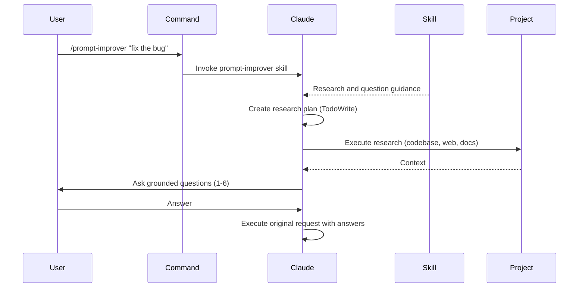

# Claude Code Prompt Improver

An on-demand `/prompt-improver` skill that enriches vague prompts before Claude Code executes them. Uses the AskUserQuestion tool (Claude Code 2.0.22+) for targeted clarifying questions.

> Forked from [severity1/claude-code-prompt-improver](https://github.com/severity1/claude-code-prompt-improver). Changed from automatic hook mode to manual skill invocation — you decide when to improve a prompt.

## What It Does

When you run `/prompt-improver`, Claude:
1. Researches your codebase, conversation history, and web for context
2. Asks 1-6 grounded clarifying questions
3. Executes the original request with full context

**Result:** Better outcomes on the first try, without unwanted interception.

## How It Works



## Installation

**Requirements:** Claude Code 2.0.22+

### Option 1: Local Plugin Installation

**1. Clone the repository:**
```bash
git clone https://github.com/atompilot/claude-code-prompt-improver.git
cd claude-code-prompt-improver
```

**2. Add the local marketplace:**
```bash
claude plugin marketplace add /absolute/path/to/claude-code-prompt-improver/.dev-marketplace/.claude-plugin/marketplace.json
```

Replace `/absolute/path/to/` with the actual path where you cloned the repository.

**3. Install the plugin:**
```bash
claude plugin install prompt-improver@local-dev
```

**4. Restart Claude Code**

Verify installation with `/plugin` command.

## Usage

```bash
/prompt-improver fix the bug
/prompt-improver add authentication
/prompt-improver refactor the API
```

**Example — vague prompt:**
```
/prompt-improver fix the error
```

Claude researches, then asks:
```
Which error needs fixing?
  ○ TypeError in src/components/Map.tsx (recent change)
  ○ API timeout in src/services/osmService.ts
  ○ Other (paste error message)
```

You select an option, Claude proceeds with full context.

**Direct skill invocation (alternative):**
```
Use the prompt-improver skill to research and clarify: "add authentication"
```

## Design Philosophy

- **User-initiated** - Only runs when you ask for it, zero overhead otherwise
- **Research first** - Questions grounded in codebase findings, not assumptions
- **Use conversation history** - Avoid redundant exploration
- **Max 1-6 questions** - Enough for complex scenarios, still focused
- **Transparent** - Research and reasoning visible in conversation

## Architecture

**Skill (skills/prompt-improver/) - Research & Question Logic:**
- **SKILL.md**: Research and question workflow
  - 4-phase process: Research → Questions → Clarify → Execute
  - Links to reference files for progressive disclosure
- **references/**: Detailed guides loaded on-demand
  - `question-patterns.md`: Question templates
  - `research-strategies.md`: Context gathering strategies
  - `examples.md`: Real prompt transformations

**Why main session (not subagent)?**
- Has conversation history
- No redundant exploration
- More transparent
- More efficient overall

## FAQ

**Does this run on every prompt?**
No. It only runs when you use `/prompt-improver`. Zero overhead on normal prompts.

**Will it slow me down?**
Only when you choose to use it. The research phase gathers context, then asks focused questions.

**Can I customize behavior?**
It adapts automatically using conversation history, dynamic research planning, and CLAUDE.md.

## License

MIT
